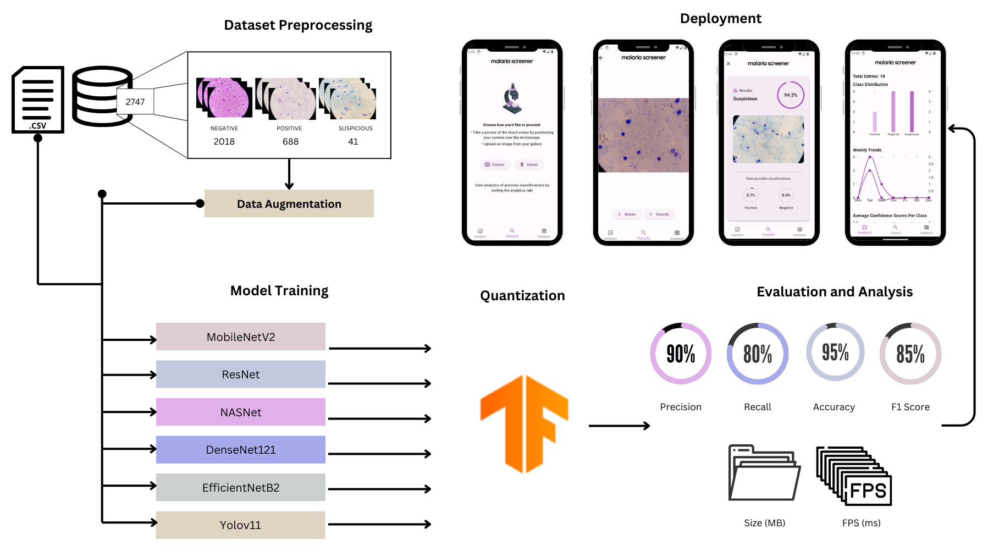

# On-Edge Mobile Diagnosis of Malaria Parasites using Machine Learning.

This project aims towards optimizing machine learning models for Malaria Parasities diagnosis and localization through on-edge devices. The general methodology followed focuses on attempting to deploy an accurate machine learning model on a mobile device while maintaining an acceptable application size given IOS and Android limitaions of ~100MB maximum size. The application developed comes with two options; classification and object detection through a user-friendly interface. The methodology followed in this work is shown below.  

The qunatization methods used include floating point 16 (FP16), Integer Qunatization using representation learning (INT-REP), and Qunatization Aware Training (QAT). All obtained models are available at models folder. The release version of the application developed is available under mobileapp folder. The project report is available at the main branch. 

The dataset can be obtained through: https://zindi.africa/competitions/lacuna-malaria-detection-challenge/data

#### Mobile Application Walkthrough

The app consists of 3 main screens: 1. Analytics, 2. Classify, and 3. Database. You can navigate through the screens using the bottom navigation bar.

In the Analytics tab, you will see charts based on previous reports.
In the Classify tab, you will be asked to either take a picture of the blood smear under the microscope or upload an already existing image. Once done, you will be able to review the image and choose whether to proceed or go back. By clicking on proceed, the classification model will be called and you will see the results of the classification displayed. The results are automatically saved to the database. When the X at the top left is clicked, you will redirected to repeat the process, if desired.
In the Database screen, all previous classifications will be displayed. By clicking on one of the entries, you will be able to see a more detailed report about the classification. By swiping right on an entry, you can delete the classification report or you can delete all entries by tapping the three dots on the top right corner.
